# Database

All models use Django's default `BigAutoField` primary key (`id`). Fields
not marked `blank`/`null` are required. Field types shown are the Django
field class; `choices` fields store their raw value (e.g. `"s1"`), not the
display label.

## accounts

### Profile
One-to-one with `auth.User`.

| Field | Type | Constraints |
|---|---|---|
| user | OneToOneField → User | CASCADE, related_name `profile` |
| full_name | CharField(200) | required |
| title_prefix | CharField(30) | blank |
| title_suffix | CharField(60) | blank |
| nidn | CharField(30) | blank |
| nip | CharField(30) | blank |
| orcid | CharField(50) | blank |
| scopus_id | CharField(50) | blank |
| sinta_id | CharField(50) | blank |
| google_scholar_id | CharField(50) | blank |
| email | EmailField | blank |
| phone | CharField(30) | blank |
| photo | ImageField | blank, null |
| bio | TextField | blank |
| institution | CharField(200) | blank |
| faculty | CharField(200) | blank |
| department | CharField(200) | blank |
| current_position | CharField(200) | blank |
| linkedin_url | URLField | blank |
| personal_website | URLField | blank |
| public_email | EmailField | blank — shown on the public CV page instead of `email` |
| show_phone_publicly | BooleanField | default False |
| public_slug | CharField(12) | unique, auto-generated, not editable in forms |

## cv

### Education
| Field | Type | Constraints |
|---|---|---|
| degree_level | CharField(10), choices | s1 / s2 / s3 / postdoc |
| institution | CharField(255) | required |
| program | CharField(255) | required |
| country | CharField(100) | required |
| start_year | PositiveIntegerField | required |
| end_year | PositiveIntegerField | blank, null |
| thesis_title | CharField(500) | blank |
| gpa | DecimalField(4,2) | blank, null |
| is_public | BooleanField | default False |

### Position
| Field | Type | Constraints |
|---|---|---|
| title | CharField(255) | required |
| organization | CharField(255) | required |
| category | CharField(20), choices | structural / functional / organizational / professional |
| start_date | DateField | required |
| end_date | DateField | blank, null — null means current |
| description | TextField | blank |
| sk_document | ForeignKey → documents.Document | SET_NULL, blank, null |
| is_public | BooleanField | default False |

### Achievement
| Field | Type | Constraints |
|---|---|---|
| title | CharField(255) | required |
| issuer | CharField(255) | required |
| level | CharField(20), choices | institutional / national / international |
| date | DateField | required |
| description | TextField | blank |
| certificate | ForeignKey → documents.Document | SET_NULL, blank, null |
| is_public | BooleanField | default False |

### Skill
| Field | Type | Constraints |
|---|---|---|
| name | CharField(100) | required |
| category | CharField(20), choices | technical / language / research |
| proficiency | PositiveSmallIntegerField | 1–5 |
| is_public | BooleanField | default False |

### TrainingCertification
| Field | Type | Constraints |
|---|---|---|
| name | CharField(255) | required |
| provider | CharField(255) | required |
| date | DateField | required |
| expiry_date | DateField | blank, null |
| certificate | ForeignKey → documents.Document | SET_NULL, blank, null |
| is_public | BooleanField | default False |

## documents

### Document
| Field | Type | Constraints |
|---|---|---|
| title | CharField(255) | required |
| category | CharField(20), choices | sk / certificate / loa / contract / report / other |
| file | FileField | required; extension must be pdf/jpg/jpeg/png, max 10 MB |
| upload_date | DateField | auto_now_add |
| expiry_date | DateField | blank, null |
| tags | CharField(255) | blank — comma-separated |
| notes | TextField | blank |

No `is_public` field — documents are never shown on any public page, only
linked from records that are (`Position.sk_document`,
`Achievement.certificate`, `TrainingCertification.certificate`,
`IntellectualProperty.certificate`, `Deliverable.document`).

## publications

### Publication
| Field | Type | Constraints |
|---|---|---|
| pub_type | CharField(20), choices | journal_article / conference_paper / book / book_chapter |
| title | CharField(500) | required |
| authors | TextField | required — citation-order author list |
| venue | CharField(500) | required |
| year | PositiveIntegerField | required |
| volume | CharField(50) | blank |
| issue | CharField(50) | blank |
| pages | CharField(50) | blank |
| doi | CharField(255) | blank |
| url | URLField | blank |
| indexing | CharField(20), choices | scopus_q1..q4 / wos / sinta_1..6 / other / none |
| citation_count | PositiveIntegerField | default 0 |
| is_corresponding_author | BooleanField | default False |
| grant | ForeignKey → research.Grant | SET_NULL, blank, null |
| is_public | BooleanField | default False |

`Publication.objects` is a `PublicationManager` with a `.stats()` method
returning `{total, by_type, by_indexing, by_year}` aggregate counts, used by
the dashboard and the publications list page.

### IntellectualProperty
| Field | Type | Constraints |
|---|---|---|
| title | CharField(500) | required |
| ip_type | CharField(20), choices | copyright / patent / trademark |
| registration_number | CharField(100) | blank |
| certificate | ForeignKey → documents.Document | SET_NULL, blank, null |
| registration_date | DateField | required |
| description | TextField | blank |
| is_public | BooleanField | default False |

## schedule

### Semester
| Field | Type | Constraints |
|---|---|---|
| name | CharField(100) | required |
| start_date | DateField | required |
| end_date | DateField | required |
| is_active | BooleanField | default False |

### Course
| Field | Type | Constraints |
|---|---|---|
| code | CharField(20) | required |
| name | CharField(255) | required |
| credits | PositiveSmallIntegerField | SKS |
| program | CharField(255) | required |
| level | CharField(10), choices | s1 / s2 |

### TeachingAssignment
| Field | Type | Constraints |
|---|---|---|
| course | ForeignKey → Course | CASCADE, related_name `assignments` |
| semester | ForeignKey → Semester | CASCADE, related_name `assignments` |
| class_label | CharField(50) | required |
| day_of_week | IntegerField, choices | 0=Monday .. 5=Saturday |
| start_time | TimeField | required |
| end_time | TimeField | required |
| room | CharField(100) | blank |
| student_count | PositiveIntegerField | default 0 |
| is_public | BooleanField | default False |

### Event
| Field | Type | Constraints |
|---|---|---|
| title | CharField(255) | required |
| category | CharField(20), choices | meeting / seminar / workshop / exam_committee / guest_lecture / organizational / personal / deadline |
| start_datetime | DateTimeField | required |
| end_datetime | DateTimeField | required |
| location | CharField(255) | blank |
| is_online | BooleanField | default False |
| meeting_url | URLField | blank |
| notes | TextField | blank |
| related_grant | ForeignKey → research.Grant | SET_NULL, blank, null |
| recurrence | CharField(10), choices | none / weekly / monthly |
| visibility | CharField(10), choices | private / busy / public — default private |

`visibility` (not `is_public`) is Event's privacy field: `busy` renders as
an untitled "Busy" block on the public schedule; `public` renders the title
and location only, never notes or meeting_url.

## supervision

### Student
| Field | Type | Constraints |
|---|---|---|
| name | CharField(255) | required |
| nim | CharField(50) | required — student ID |
| program | CharField(255) | required |
| thesis_title | CharField(500) | blank |
| level | CharField(10), choices | s1 / s2 |
| status | CharField(20), choices | proposal / in_progress / seminar / defended / graduated / inactive |
| start_date | DateField | required |
| target_defense_date | DateField | blank, null |

### Milestone
| Field | Type | Constraints |
|---|---|---|
| student | ForeignKey → Student | CASCADE, related_name `milestones` |
| name | CharField(255) | required |
| due_date | DateField | required |
| completed_date | DateField | blank, null |
| notes | TextField | blank |

### SupervisionLog
| Field | Type | Constraints |
|---|---|---|
| student | ForeignKey → Student | CASCADE, related_name `logs` |
| date | DateField | required |
| mode | CharField(10), choices | in_person / online |
| summary | TextField | required |
| next_action | TextField | blank |

## research

### Grant
| Field | Type | Constraints |
|---|---|---|
| title | CharField(500) | required |
| funder | CharField(255) | required |
| grant_number | CharField(100) | blank |
| scheme | CharField(255) | blank |
| role | CharField(10), choices | pi / co_pi / member |
| amount | DecimalField(15,2) | blank, null |
| currency | CharField(10) | default "IDR" |
| start_date | DateField | required |
| end_date | DateField | blank, null |
| status | CharField(20), choices | proposed / awarded / active / completed / rejected |
| is_public | BooleanField | default False |

### Deliverable
| Field | Type | Constraints |
|---|---|---|
| grant | ForeignKey → Grant | CASCADE, related_name `deliverables` |
| name | CharField(255) | required |
| type | CharField(20), choices | report / publication / prototype / ip |
| due_date | DateField | required |
| completed | BooleanField | default False |
| document | ForeignKey → documents.Document | SET_NULL, blank, null |

## service

### CommunityService
| Field | Type | Constraints |
|---|---|---|
| title | CharField(500) | required |
| partner | CharField(255) | blank |
| location | CharField(255) | blank |
| date | DateField | required |
| funding_source | CharField(255) | blank |
| output | CharField(500) | blank |
| description | TextField | blank |
| is_public | BooleanField | default False |

### OrganizationalRole
| Field | Type | Constraints |
|---|---|---|
| organization | CharField(255) | required |
| role | CharField(255) | required |
| start_date | DateField | required |
| end_date | DateField | blank, null — null means current |
| description | TextField | blank |
| is_public | BooleanField | default False |

## dashboard

No models — an aggregation/search/public-pages layer over the other apps.

## Entity relationship diagram

```mermaid
erDiagram
    User ||--o| Profile : "has"
    Document ||--o{ Position : "sk_document"
    Document ||--o{ Achievement : "certificate"
    Document ||--o{ TrainingCertification : "certificate"
    Document ||--o{ IntellectualProperty : "certificate"
    Document ||--o{ Deliverable : "document"
    Grant ||--o{ Publication : "grant"
    Grant ||--o{ Event : "related_grant"
    Grant ||--o{ Deliverable : "grant"
    Course ||--o{ TeachingAssignment : "course"
    Semester ||--o{ TeachingAssignment : "semester"
    Student ||--o{ Milestone : "student"
    Student ||--o{ SupervisionLog : "student"

    Profile {
        int id PK
        int user_id FK
        string full_name
        string public_slug
    }
    Document {
        int id PK
        string title
        string category
        file file
    }
    Education {
        int id PK
        string degree_level
        string institution
        bool is_public
    }
    Position {
        int id PK
        string title
        int sk_document_id FK
        bool is_public
    }
    Achievement {
        int id PK
        string title
        int certificate_id FK
        bool is_public
    }
    Skill {
        int id PK
        string name
        int proficiency
        bool is_public
    }
    TrainingCertification {
        int id PK
        string name
        int certificate_id FK
        bool is_public
    }
    Publication {
        int id PK
        string title
        int year
        int grant_id FK
        bool is_public
    }
    IntellectualProperty {
        int id PK
        string title
        int certificate_id FK
        bool is_public
    }
    Semester {
        int id PK
        string name
        bool is_active
    }
    Course {
        int id PK
        string code
        string name
    }
    TeachingAssignment {
        int id PK
        int course_id FK
        int semester_id FK
        bool is_public
    }
    Event {
        int id PK
        string title
        int related_grant_id FK
        string visibility
    }
    Student {
        int id PK
        string name
        string nim
        string status
    }
    Milestone {
        int id PK
        int student_id FK
        date due_date
    }
    SupervisionLog {
        int id PK
        int student_id FK
        date date
    }
    Grant {
        int id PK
        string title
        string status
        bool is_public
    }
    Deliverable {
        int id PK
        int grant_id FK
        int document_id FK
    }
    CommunityService {
        int id PK
        string title
        bool is_public
    }
    OrganizationalRole {
        int id PK
        string organization
        bool is_public
    }
```

